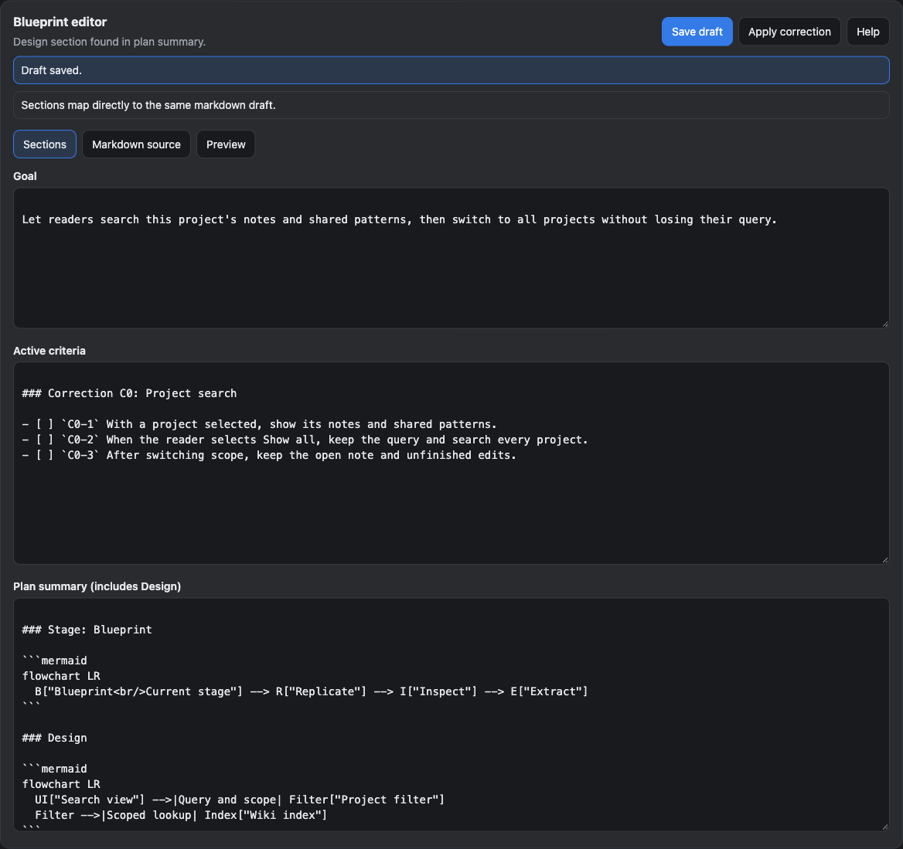
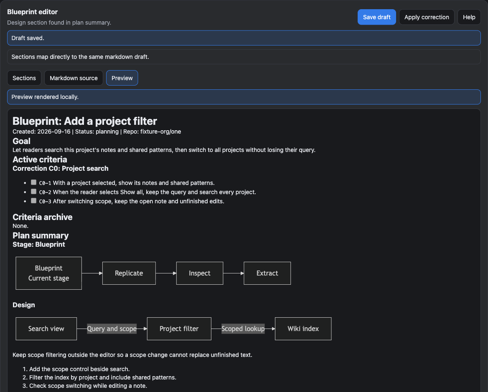
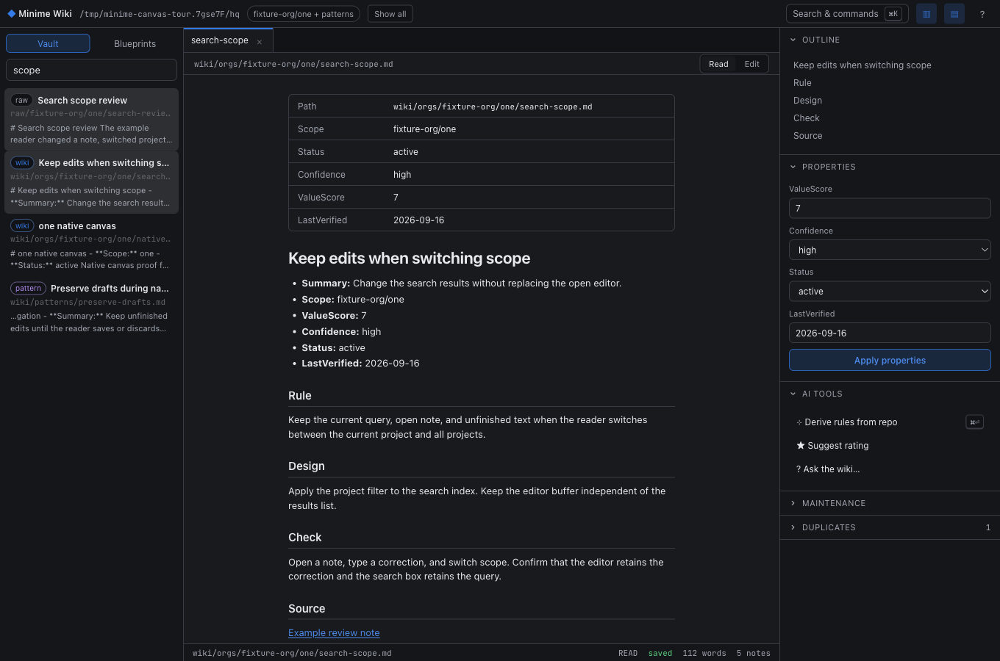
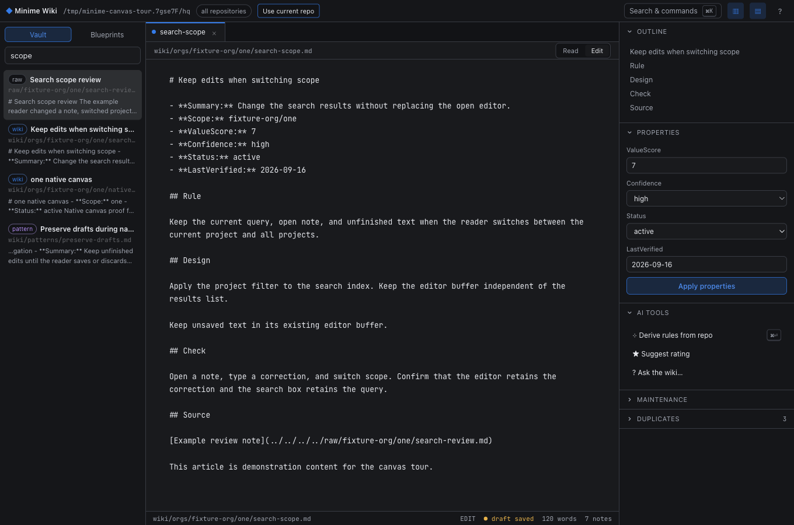

# Canvas tour

Ask Copilot to open your blueprint or Minime Wiki. These screenshots show the canvas content with example data and a dark theme.

## Edit a blueprint

In **Sections**, edit the Goal, Active criteria, and Plan summary. Use **Markdown source** to edit the full document.

- **Save draft** keeps your edits separate from the blueprint that workers read. Press **Cmd/Ctrl+S** to save.
- **Apply correction** queues the saved draft for the task owner to apply at the next safe worker boundary.
- **Help** lists keyboard controls. Above the editor, **Current work** links to the active criterion, evidence, and agents.

Switch to **Preview** to read the formatted blueprint and check its stage and design diagrams.

## Search the wiki

Search and open a result. Choose **Show all** to include every project. **Use current repo** restores this project's notes plus shared patterns.

## Edit a wiki article

Choose **Edit** to change the Markdown. The canvas saves a draft as you type; press **Cmd/Ctrl+S** or choose **Save note** in **Search & commands** to update the article.

Save the article before changing **Properties**, then choose **Apply properties**. You cannot edit raw sources. For a blueprint listed in the wiki, choose **Open in blueprint canvas** to edit it.

See [Canvas guidance](../assets/CANVAS.md) for agent behavior and correction handling.
